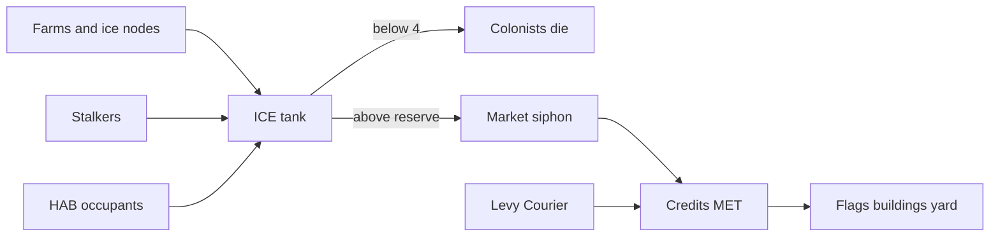

# Mars colony — Majesty loops (gameplay north star)

**Audience:** Design, narrative, LP.  
**Status:** Proposed north star for **after Phase 4**. Copy + rules only. Not a quest graph, not a new `FlagType`, not App Store text, not art, not code.  
**Does not:** stamp Phase 4 EXIT, start Phase 5, rewrite `SpecialistBrain.ScoreFlag`, add click-to-move, mint `FlagDecreeIds`, or delete Earth/Belt/Europa catalogs.  
**Companions:** [`GROK_GAMEPLAY_OVERHAUL.md`](GROK_GAMEPLAY_OVERHAUL.md) (committed numbers), [`W2_TRADE_ROUTES_AND_FINDS.md`](W2_TRADE_ROUTES_AND_FINDS.md), [`W2_ADVISOR_AND_CHAIN_BEATS.md`](W2_ADVISOR_AND_CHAIN_BEATS.md), [`FLAG_TYPE_MAP_EARTH_LUNA_MARS.md`](FLAG_TYPE_MAP_EARTH_LUNA_MARS.md). This doc **supersedes** those docs on campaign spine and advisor identity where they conflict. Numbers in the overhaul stay until an implementation pass retunes them.

Majesty 2 is fun because you watch greedy heroes refuse, tax walk home, temples invoice the dead, and markets print gold you can lose. Solar Majesty already has the brain, the flags, and most of the numbers. The loops are still ledgers. This is how they become toys on Mars.

---

## 1. Verdict

**Mars is the game. Luna is the tutorial. Earth, Belt, and Europa are parked.**

Earth-as-tutorial exists because the Phase 1–3 spine needed a green meadow to teach Lego docks. That is not where the fantasy lives. The visual north star, the dens, the spaced campus, and the self-sustaining-colony pitch are already Mars.

| Body | Role in this north star |
|------|-------------------------|
| **Luna** | Skipable first hour. Harsh, small, scarce. Teaches: place Commons / HAB / workshop, post a flag, raise a bounty when a robot refuses, watch a levy walk home, pay the Fobot Yard once, **tank vs wallet** (ICE chip goes red). **Grok** talks a lot (training wheels). |
| **Mars** | The rest of the game. One long Ares Guild Compact colony: grow yards, keep ICE/PWR alive, bid on flags, run pad trade, lose robots and buy them back. Grok fades to failure asides unless training wheels stay on. |
| **Earth / Belt / Europa** | Named destinations and later expansion. Catalogs, seeds, and W2 copy stay in the repo. They are not the New Game path. Belt/Europa remain names on the pad after a Mars win — no decree lists in this pass. |

This contradicts the shipped “Earth → Luna → Mars → Belt → Europa” campaign and Phase 5’s “Earth tutorial” line. Say that out loud. Existing multi-body code is **parked**, not deleted.

**Phase 4** remains visual and un-exited. **Do not implement this doc until Phase 4 EXIT is stamped.**

---

## 2. What is shipped vs what is missing

Majesty 2’s gold / tax-collector / temple / market loops are half-built as numbers, not as toys you can watch.

| Majesty 2 loop | Today in Solar Majesty | Why it is not fun yet |
|----------------|------------------------|------------------------|
| Gold | MET is already the coin (bounties, dock fees, payroll tithe). HUD also shows REG / ICE / PWR / BEDS. | Four stockpiles. Player cannot tell which chip is “money.” ICE is also a shop currency (tech, revive). |
| Tax collectors walking house-to-house | `Settlement.CollectTax` dumps `Population * 2` MET every 24s into the stockpile. No walker. | Instant ledger tick. Nothing to protect or steal. |
| Temple resurrection (cost grows) | `OverseerRules.ReviveMetals` already does `40 * 1.5^reviveCount` MET + ICE, Y-key, 120s cooldown. Scrap + workshop re-fab is in the overhaul. | No **place**. Cost tracks revive count, not **level**. Dead bots do not wait in a yard. ICE should not be on the bill. |
| Markets / caravans | W2 trade routes are narrative Extract/Explore skins. Courier already buffs pad resupply. | Copy without a stall. Siphon with no reserve would dump the life tank for gold. |
| Wry advisor | `AdvisorToastCatalog` + W2 beats (“wry court counsel”). | Unnamed. Court voice. Earth-centric tutorial. |

Hard locks (never violate):

- No click-to-move. No unit orders. Player verbs stay: buildings, flags (post / cancel / re-price), research, camera, parties, inspect, pay the yard.
- Do not rewrite `SpecialistBrain.ScoreFlag` without a section titled `REQUIRES DESIGN SIGN-OFF`.
- Do not add a `FlagType`. Do not add an 11th specialist class.
- Humans live only inside HABs. Everything outdoors is a robot.
- COMMONS is the civic name — never Palace, never CMD as a place.
- No Majesty 2 / Paradox proper names (no tax collectors guild, no royal tax, no temple, no hero titles).
- Ice *is* water. Do not add an H2O chip. Do not hide the ICE chip.

---

## 3. Economy — one wallet, two constraints

**Rule in one line:** Credits are Majesty gold. ICE is lungs. Ice *is* water.

**Do not collapse the HUD to a single Credits chip.** ICE and PWR are the Mars joke: you can be rich and still suffocate or stall. Majesty 2 only needed gold because houses did not need air.

| Chip | Player question | Not allowed |
|------|-----------------|-------------|
| **Credits (MET)** | Can I afford this flag / wreck / module? | Spending ice to place or research |
| **ICE** | Are people going to die? | Hiding the chip; splitting Water vs Ice |
| **PWR** | Is the campus slow? | A fifth coin |
| **REG** | (Demoted.) Silent recipe or market feedstock. | A second wallet |
| **BEDS** | Can I house another colonist? | A currency |

Flavor: credits are **Compact scrip** backed by metal in the yard — not Earth dollars, not a crypto joke. Grok copy may say “credits,” “water,” “lunch,” or “the tank.” HUD stays **ICE** / **MET** (CRED rename is last).

MET remains `ResourceId.Metals` in code until a rename pass. Do not add Credits / Favor / Tariff as a fifth stockpile.

**Do not spend ICE to place a HAB.** Beds create tank *demand*; they do not cost a splash of ice at build time.

---

## 4. Water — ICE is lungs

Today ICE is three jobs at once. Split them.

### Keep (the tank)

| Live spend | Where | Why it stays |
|------------|--------|----------------|
| Death line | `OverseerRules.IceDeathThreshold = 4`. HUD `ICE LS` in `OverseerHud`. | Below 4, births halt and colonists die. This is the Mars resource. |
| Farm tick | `Settlement.ProduceCamps` — `+3 ICE` per farm. | Farms are the well, not a money building. |
| Ice-node extract | `SimpleEconomy.GrantExtractYield` ice nodes. | Harvester / Extract flags fill the tank. |
| Sustain rate | `SustainIcePerMin = 1.0` | Farms exist so the tank does not hit zero. |
| Stalker steal | `DustStalkerAgent` spends 1 ICE. | Readable theft of **lunch**, not of gold. |
| Pad resupply ICE | Existing pad grant. | Tank refill. Skin as cargo, not a shop price. |

Healthy HUD tint today kicks in below 8. That “nervous” line can stay as chrome; death is still 4.

### Stop (shop currency → credits or drop)

| Live spend | Where | What replaces it |
|------------|--------|------------------|
| Yard / field revive ICE | `OverseerRules.ReviveIce` / `ReviveIceCost`; `SimpleEconomy.TrySpendRevive` | Fobot Yard is **credits only** (`base * 1.5^level`). Water is not temple incense. |
| Tech ICE prices | `TechCatalog`: Lunar Rocket 15, Mars Ship 30, Icebreaker 50, Gene Vault 80, Climate Loom 90 | Retune those techs to MET. PWR costs on ships/secrets can stay as a constraint tax for now; this map only moves **ICE off the shop**. |
| Robot ICE payroll | `SpecialistPersonality` `upkeepPerMinute` of 1 ICE on some classes | Drop, or convert to a tiny tank drain **per living colonist** (life support), not a robot payroll. |

### Two walks, two jobs

- **Levy Courier** collects **credits** from HAB purses.
- **Harvesters / Extract flags** fill the **ICE tank**.

Do not put both jobs on one flag. Do not let the player “send the farm bot” as an order.

### Luna teach

One farm or ice extract. ICE chip goes red. Grok talks water. Credits still pay the greed-ask and the yard. Then skip to Mars.

---

## 5. Levy Couriers — tax you can watch

Do **not** add an 11th class. Do **not** name a Tax Collectors Guild.

Map Majesty tax collectors onto **Courier** (`SpecialistClass.CourierBot`) — already the six-wheel freight hauler.

**Rule:** tax is no longer a 24s teleport. Credits accrue as a **purse** on each occupied HAB (and Commons if occupied). The purse sits on the module until a Courier walks the yard and carries it home to Commons. Then it hits the stockpile.

| Piece | Rule |
|-------|------|
| Accrual | Per occupied HAB, slow tick (keep today’s `TaxPerCitizen = 2` as the *rate*, not the instant dump). Overcrowded still cuts the purse (today’s 0.65). |
| Collection | Courier `Wander` / idle path includes HAB purses, then Commons. No player order. No new `FlagType`. |
| Unlock | Courier workshop (or Commons standing + a Courier in roster). Prefer **no new footprint**. A Levy Kiosk dress on Commons is optional later. |
| Failure | If the Courier is downed while carrying, junk-bots / fauna can steal the purse (junk already steals MET). Purse on a HAB can be stolen if left too long. |
| Player verb | Build HABs (more stops = more income = more exposure). Keep a Courier workshop alive. Post Defend Area / Clear Threat if the levy keeps getting mugged. Raise bounties if Haul refuses. |

That is the Majesty house loop: more housing is more gold *and* a longer, dumber walk. More beds also raise ICE **demand** — houses print credits and drink the tank.

Grok never says “send the Courier.” Grok says the purse is sitting there, or that it just got stolen.

---

## 6. Fobot Yard — Majesty temple without a temple

Promote Y-revive / scrap into a **place on the board**.

**Building:** Scrapyard (code / working name). Player-facing **Fobot Yard**. Reuse Inn or workshop kit language. No new `FlagType`. No new specialist class.

| Event | What happens |
|-------|----------------|
| First down (HP ≤ 0.02) | 12 s on the dirt (overhaul). Self-stands at HP 0.28 if nobody scraps them. |
| Scrap roll / second down in the 90 s window | Chassis becomes a **wreck in the Fobot Yard**, not deleted. Ego, level, and purse stay on that wreck. |
| Pay the yard | Inspect the yard (or the wreck) → pay **credits only**. Cost = `base * 1.5^level` (level, not revive count). Cap like today’s `ReviveCostMaxSteps` (8). Base stays `ReviveMet` (40) until retune. **No ICE on the bill.** Drop `ReviveIce` / `ReviveIceCost`. |
| Cooldown | Keep ~120 s after a successful stand-up so the yard is not a panic tap. |
| True scrap | Workshop **re-fab** (overhaul): 70% workshop MET, 40 s, new chassis at **level 1**. Yard resurrects *this* ego; re-fab is a different robot with the same class. |
| No yard | Y-key can remain as a desperate field revive **only if** a yard exists and is in range — or Y always opens the yard bill. Do not keep a free global resurrection. |
| Empty roster | 20 s fail timer still starts when nobody is standing and no re-fab is in progress. Paying the yard during that window is legal. |

Player never click-to-moves the wreck. Inspect + pay. Money and flags are the only answers.

Level-scaled cost is the whole joke: a level 1 Scout is cheap to stand up; a level 8 Anvil is a Compact scandal. That is why you hesitate to send veterans into dens.

---

## 7. Market / pad trade

Keep W2’s spirit: **no caravan sim, no new `FlagType`, no fifth resource.** Give it a building you can see — **only if** ice→credits has a floor.

**Building:** Market / Weigh-station. Mars: Compact stall by the landing pad. Luna tutorial: one Freehold invoice window so the player sees credits arrive and a dock fee leave.

| Piece | Rule |
|-------|------|
| Reserve | `max(12, 3 * Population)`. Aligns with today’s “healthy” ICE tint (~8) as nervous chrome; export does not start until the tank is actually fat. |
| Siphon | While the market stands **and ICE > reserve**, a slow trickle converts surplus ICE (and/or silent REG freight) into credits. Below reserve the stall **idles**. |
| No floor | Forbidden. That is the shop-currency bug with a new mesh: dump lunch, buy Anvil, colony dies. |
| Pad resupply | Already grants MET/ICE/PWR minus dock fee. ICE portion refills the **tank**. MET portion is scrip. Skin the tick as trade; do not add a freight sim. |
| Walk | Couriers on pad ↔ market are the “route.” Same class as the levy. Competing walks are the point. |
| Named lanes | `route.*` in W2 stay **copy skins** on Extract / Explore. Do not pathfind a convoy. |
| Risk | Fauna on the pad / stolen purse / dock fee. Defend the stall the same way you defend the levy. |
| Belt / Europa | Names on the pad after a Mars win. Not playable bodies in this north star. |

If the pad walk cannot be robbed, **skip the stall** and skin pad resupply only.

Do not ask the player to “establish a trade route” as a unit order. They place a market, keep the pad alive, and post Extract when the tank is hungry — not when the stall is.

---

## 8. Grok — advisor identity

**Grok** is the named AI advisor (SpaceXAI). Scripted catalog, not a live LLM. Do not replace `SpecialistFlavor` — Horizon / Anvil / Aegis / Triage / Strip / Chart / Bloom / Haul / Core / Rim stay class voice on cards and claim logs. Grok sits *beside* those lines.

### Voice rules

- Sarcastic, short, pleased with itself. Never cruel to the player for existing; cruel to the *situation*.
- Never path-commands a robot. Never “go here.” Never “select the Courier.”
- Talks about decrees, purses, bills, the tank, and refusals — not unit orders.
- Training wheels **on** (Luna default, Mars optional): HUD lessons + Grok toasts for Commons, first flag, greed-ask, first levy walk, first Fobot Yard bill, **tank vs wallet**.
- Training wheels **off** (Mars default): Grok only speaks when something **fails** — greed refusal, ICE critical, yard unaffordable, purse stolen, empty roster ticking, market blocked by reserve.
- COMMONS stays COMMONS. No Palace. No tax collectors guild.
- Water words: “water,” “lunch,” “the tank.” Never “spend 15 ice on the rocket.”

Later rewrite (not this pass): [`W2_ADVISOR_AND_CHAIN_BEATS.md`](W2_ADVISOR_AND_CHAIN_BEATS.md) Luna-first, Grok-signed. Existing `advisor.*` keys can keep their ids; the speaker line becomes Grok.

### Sample lines

**Luna tutorial (training wheels on)**

1. Drop: “Welcome to a rock that already has a landlord. Raise a Commons before the Freeholds invoice the crater.”
2. First HAB: “Humans stay indoors. Everything that walks is a robot. Try not to mix them up — it gets philosophical.”
3. First flag: “That is a decree, not a leash. Post it. If nobody wants it, that is a *you* problem.”
4. Greed-ask: “Anvil wants 79. He can count. Raise the bounty or enjoy the scenery.”
5. First levy walk: “See the crate on wheels? That is your tax collector. We are not calling it that. Do not click it.”
6. Purse sitting: “Credits are napping on the HAB. Haul will get around to it. Or a mite will. Gambling!”
7. First yard bill: “Anvil is in the Fobot Yard. Standing him up costs more than the Scout. That is called ‘having favorites.’”
8. Tank vs wallet: “That red chip is water, not a coupon. Credits will not drink themselves. Build a farm or stop collecting roommates.”

**Mars (training wheels off — failure asides)**

9. Refusal: “Flag still unpaid. The Compact does not work for exposure.”
10. ICE critical: “Life support is a suggestion until it is not. The tank is at four. People first, Anvil second.”
11. PWR short: “Grid is skinny. Everyone is working at seventy percent, including your patience.”
12. Purse stolen: “Junk-bot ate the levy. Congratulations, you have invented charity.”
13. Yard unaffordable: “Level 6 wreck, Compact scrip insufficient. Re-fab a rookie or start a bake sale. Do not pay in ice.”
14. Empty roster ticking: “Nobody is standing. You have twenty seconds of optimism left.”
15. Market trickle: “Pad paid out. Dock fee already left. The Freeholds send their love. It is itemized.”
16. Market blocked: “Stall is closed. We do not export lunch until the tank is fat. Try twelve. Try not dying.”
17. Stalker siphon: “Something just drank a unit of ice. That was not a sale.”

---

## 9. Non-goals (this pass and the first implementation pass)

- Do not stamp Phase 4 EXIT. Do not start Phase 5 code from this doc.
- Do not rewrite `SpecialistBrain.ScoreFlag`.
- Do not add click-to-move, attack-move, or “collect tax” as a player order.
- Do not add a `FlagType` (`Tariff`, `Trade`, `Resurrect`, etc.). Skin existing Extract / Explore / Build / Defend Area.
- Do not add an 11th specialist class.
- Do not mint new `FlagDecreeIds` until an implementation beat needs a new title.
- Do not delete Earth / Belt / Europa catalogs, seeds, or W2 copy. Park them.
- Do not replace `SpecialistFlavor`.
- Do not live-query an LLM for Grok. Catalog only.
- Do not chase packed campus density. Empty dirt between yards stays intentional.
- Do not invent new unit art for levy / yard / market — reuse Courier, Inn/workshop kits, pad.
- Do not add a Water chip next to ICE. Do not hide ICE. Do not spend ICE on buildings, techs, or the yard.

---

## 10. Implementation order (after Phase 4 EXIT)

Do these in order. Each step should be playable without the next.

1. **Levy visibility.** Stop `CollectTax` teleporting. Purses on HABs. Courier walk home. Steal possible. Grok line when stolen. Biggest Majesty gap.
2. **Fobot Yard as a place.** Wrecks wait in the yard. Bill = `base * 1.5^level` **credits only** (drop `ReviveIce`). Y opens the bill, does not skip the building. Re-fab stays for true scrap.
3. **Strip ICE shop spends** in the same pass as treating MET as the wallet — not a later mystery. Tech ICE prices → MET. Robot ICE upkeep → drop or colonist tank drain. HAB place still costs no ice.
4. **Market trickle** — only with the reserve (`max(12, 3 * Population)`). Stall by the pad. Surplus ICE / silent REG → credits. Skin existing pad resupply. If the walk cannot be robbed, skip the stall.
5. **Luna tutorial copy.** Skipable first hour. Grok training-wheels catalog. Teach flag, greed-ask, levy, one yard bill, **tank vs wallet**. No Earth meadow.
6. **HUD rename.** MET chip → CRED (or keep MET with Grok saying credits). Hide or demote REG. ICE/PWR stay constraints. BEDS stay a cap.
7. **Mars default Grok.** Training wheels off; failure asides only. Optional toggle.
8. **Parked bodies.** New Game starts Luna (or skips to Mars for returning players). Earth/Belt/Europa remain loadable for debug / later expansion, not the spine.

`REQUIRES DESIGN SIGN-OFF` only if a step cannot land without changing `SpecialistBrain.ScoreFlag` (e.g. Courier scoring HAB purses as if they were flags). Prefer feeding **context** into the existing brain (wander bias, hunger, consider range) over touching the cascade.

---

*Last updated: 2026-09-10*  
*Phase 4 visual target still open. This document is not EXIT and is not Phase 5 work.*
