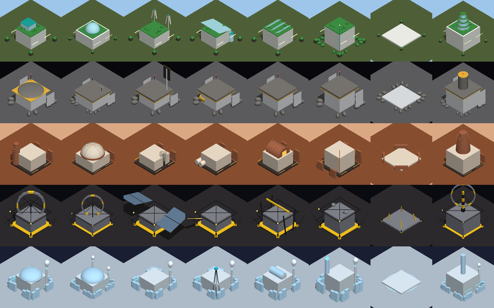

# Planet architecture

Every world now builds its own way. The same building (a habitat, the Commons, a reactor)
gets a different architectural set on each world, and each set follows what that place would
really demand.

*Offline preview from the pure layer. The plain box stands in for the building's own kit.
In game the parts wrap the real hero kit.*

| World | Style | Why | Signature pieces |
|---|---|---|---|
| Earth | Solarpunk arcology | Open air, rain and a living biosphere, so there is nothing to hide from | Green roofs, glass pavilions and atrium domes, vertical wind turbines, rain canopies with cisterns, sawtooth skylights, a tiered glass-garden wonder |
| Luna | Regolith-shielded outpost | No air, hard radiation, micrometeoroids and ±150 °C swings | Regolith berms and shield caps, gold MLI foil bands, heat radiators, red beacon masts, an Earth-facing dish, a polar sun-tracking tower, foil ice tanks |
| Mars | Printed regolith colony | Thin CO₂ air, dust storms and −60 °C | Layered 3D-printed windbreak walls on the storm side, a ribbed pressure dome, printed tapering towers and barrel vaults, a Kilopower-class reactor, ISRU propellant tanks, pad blast walls |
| Belt | Anchored microgravity station | Barely any gravity, no air and a weak, distant sun | Anchor stilts and tethers, truss frames, spin-gravity rings, huge solar wings, a mass driver, a gantry crane, point-defense turrets, a docking cradle |
| Europa | Ice-shielded cryo base | −160 °C, Jupiter's radiation and an ocean under the crust | Water-ice block walls, ice shield domes, steam vents, RTG power with glowing fins, a cryobot drill derrick, a submersible hangar with a moon pool, an ice spire |

Kit colours also regrade per world:

| World | Orange trim becomes | White shell follows |
|---|---|---|
| Luna | Gold | Luna's hull |
| Europa | Cyan | Europa's hull |
| Belt | Hazard yellow | Belt's hull (carbon becomes gunmetal) |
| Earth | Teal | Earth's hull |

Dust and wear follow each world's style. **Mars is the tuned reference look,** so its kit colours stay exactly as authored and only the new architecture is added.

## How it works

- `Systems/World/PlanetArchitecture.cs` (pure, unit-tested) holds three things:
  - `Style(world)`: a palette plus dust and wear values.
  - `ArchetypeOf(category)`: maps each category to one of eight archetypes: dwelling, hub, power, extractor, workshop, defense, pad or wonder.
  - `Adapt(world, archetype, w, d, roofHeight, seed)`: returns primitive parts in true metres.
- `Runtime/PlanetArchitectureDresser.cs` runs from `ModularBuildingFactory.Spawn`, after the ground snap. It:
  - measures the kit's roof;
  - builds the parts under a `Dress_Arch` child, with no colliders and one cached material per world and role;
  - regrades the kit's `SM_Art_*` slots per renderer with a `MaterialPropertyBlock`, so shared materials are untouched.
- **Doorways:** parts never cross the four doorway lanes at the face centres. `PlanetArchitectureTests.DoorwayLanesStayClear` checks every world, archetype and several seeds against a ~1.4 m wide lane from knee to head height.
- **Ground snap:** `SnapToGround` ignores `Dress_Arch_*` renderers, because berms and skirts are set into the ground on purpose.
- **Turning it off:** it is on by default. Launch with `-classic-buildings` or set the PlayerPrefs key `SM_Set_PlanetArchitecture` to 0 to get the previous buildings back.

## Previewing without Unity

The contact sheet above came from dumping `Adapt()` for every world and archetype in a .NET harness. A small numpy ray-caster rendered the dump, drawing boxes, cylinders and ellipsoids with the Unity Euler order, lambert shading and ground shadows. The harness isn't in the repo, but the same approach works for tuning a new world's set.

## Not yet verified in Unity

This has been compiled and tested against Unity stubs only. On a first Play Mode run, check four things:

- **Roof measurement** on dome kits (the Commons). Hub parts sit at the measured roof.
- **The Europa ice shells' transparency** against the SM_Hull shader.
- **The Belt spin rings** at isometric range.
- **The pad blast berms** don't hide the landing ship.
