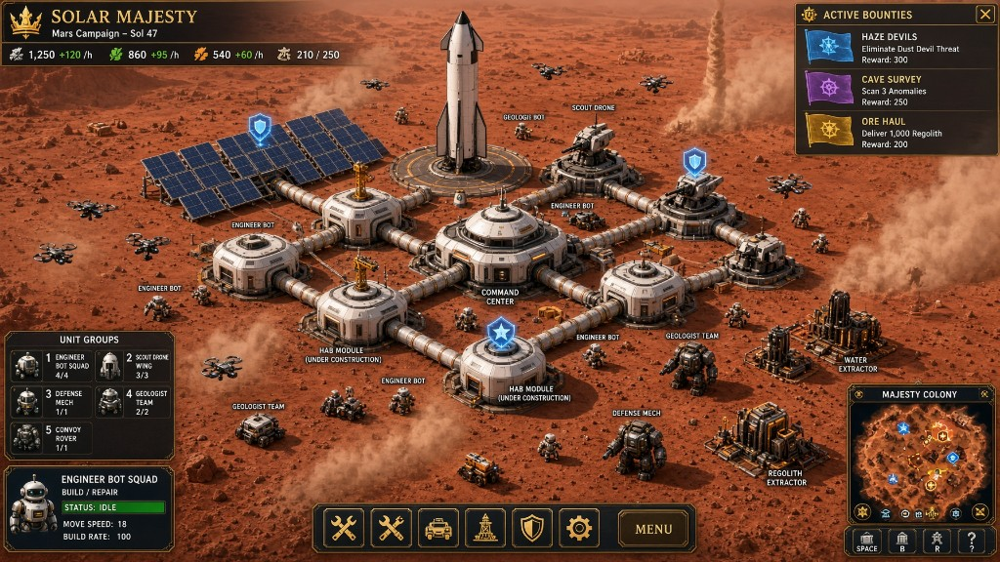

# Phase 4 – Visual Target (Art Production)

**Status:** In progress — **exit blocked** ([PHASE_4_EXIT.md](PHASE_4_EXIT.md)). Dock sockets flush; HAB / Commons / LAB / CMD-1 / OPS-1 panel bevels in. An **editor** Mars still exists (`SM_MarsCampaign_EditorStill.png`) — Commons + airlock + HAB, no HUD. A **Game-tab** Play Mode still exists (`SM_MarsCampaign_PlayModeStill.png`) — empty Mars Sol 1 + carbon HUD, **no campus**. Phase 4 is **not** complete. **Not ready for Phase 5.**  
**Duration:** 8–12 weeks  
**Goal:** Make the Mars-campaign concept-art mockup the real in-game look — environment, modular campus, hero unit meshes, construction juice, and Overseer HUD chrome — without changing the control model.

Current greybox / Lego airlocks / blockout robots are **not** this look. Phase 4 is the production pass that closes that gap. Phase 3 still owns content (classes, fauna, doctrines, wonders). Phase 5 then ships audio, accessibility, packaging, and first-hour polish on top of this visual bar.

**Week 1 (in):** Mars albedo/sky/long shadows + distant dust-devil dressing; corrugated tube cladding + orange square airlock hubs on the existing Lego docks; yellow gantry cranes / incomplete cladding on build sites; Overseer HUD carbon/gold chrome (5-chip top bar, bounty log, status roster, camera-only minimap).

**Week 2 (in):** HAB / Colony Commons / landing pad+ship / water vs regolith extractor **hero kits** on the square Lego grid (`HeroBuildingKits` via `ModularBuildingFactory`). Footprints unchanged. Tubes/domes remain dressing. Square airlocks stay; no click-to-move.

**Week 4 (in):** Player-facing **Palace → Colony Commons** (HUD **COMMONS**). Guild Hall / Laboratory / Climate Loom / Aegis Spire / Deep Archive industrial dress. Medic hover-stretcher, Harvester tracked scoop, Surveyor tripod, Courier six-wheel hauler, Sentinel dual-barrel turret remesh.

**Week 4 continued (this slice):** Game-tab empty-Sol-1 still (`SM_MarsCampaign_PlayModeStill.png`) plus empty-Mars scatter dressing (nodes / dens / vista boulders). Editor still of a Mars-graded Commons + airlock + HAB already in. Honest notes below — **not** a Phase 4 exit.

---

## Visual target

*Mars campaign visual target (2026 concept-art mockup). This is the production look for terrain, campus architecture, unit silhouettes, construction juice, and HUD chrome. StarCraft/Anno-style squad bars and click-commands in the mockup are **presentation inspiration only** — the player remains the Overseer AI.*

---

## How this extends Phase 0 (does not replace it)

Phase 0 Grok Imagine keywords stay mandatory:

> isometric view, Majesty 2 inspired readable silhouettes, SpaceX industrial aesthetic, clean white and black Starship materials with orange accents, modular habitat design, slightly exaggerated proportions for clarity, vibrant but grounded sci-fi lighting, high detail 3D render style

Phase 4 **extends** them toward this sheet (append when prompting / briefing):

> reddish Mars regolith and hazy orange sky, long low-angle shadows, white/black/orange industrial SpaceX-adjacent campus, pressurized corridor tubes linking habs, large central white command dome with orange trim, blue-glow solar arrays, circular landing pad with white Starship-like rocket, yellow gantry cranes on modules under construction, rugged extractors with piping tanks and scaffolding, junction defense turrets, translucent shield readability, dark metallic carbon HUD with gold/orange accents

Do not throw out the Phase 0 lock for a new art bible. This sheet is the fidelity target on top of that lock.

---

## Visual pillars (from the mockup)

1. **Mars atmosphere** — reddish-brown cratered regolith, dusty matte ground, hazy orange-to-pale sky, long soft shadows, distant dust-devil scale.
2. **Tube campus** — pressurized white corridor/tube network linking habs; a large central **domed command hub** (Colony Commons visual), not a scatter of identical boxes.
3. **Power and arrival landmarks** — solar field with readable blue glow; circular tiered landing pad; white vertical Starship-like rocket with black heat-shielding.
4. **Construction juice** — modules under construction carry **yellow gantry cranes** (and incomplete cladding) so build state is obvious at isometric range.
5. **Rugged extractors** — standalone water / regolith kits with piping, tanks, and scaffolding — not the same Lego box as a HAB.
6. **Defense readability** — turrets on corridor junctions; translucent shield-state over key structures.
7. **Unit silhouettes at a glance** — Engineer: small white biped; Geologist: wheeled rover; Scout: hovering drone; Defense: bulky dark walker. (Courier / convoy as a rugged wheeled hauler when that class is in.)
8. **Overseer HUD chrome** — dark metallic / carbon with gold/orange accents; top resource bar; bounty/quest log; specialist roster as **status/readout**; circular minimap. Action-bar shapes map to existing Overseer tools, never to WASD-click armies.

---

## Control mapping (chrome ≠ commands)

| Mockup chrome | Maps to (keep) | Never becomes |
|---------------|----------------|---------------|
| Selected “squad” portrait + IDLE / stats | Specialist / party **status** (who is working which flag, fatigue, greed) | Move, attack, or build-unit commands |
| Bottom action icons (build, infra, defense, menu) | **B** build, **G** flag, research, camera, parties | Direct army orders |
| Unit group roster (Engineer Squad, Scout Wing, …) | Workshop / class **readout** and party list | Control groups that issue orders |
| Hotkeys under minimap | Existing keys (Space camera, **B** build, **R** rest, …) | New click-to-move bindings |
| Bounty / quest banners | Flag / mission / bounty log | Quest markers that path a selected squad |

Non-negotiable: no click-to-move, no selected-unit commands, nothing that bypasses `SpecialistBrain`. Humans live in HABs only; outdoor units are workshop robots. Empty start; Colony Commons first.

---

## Grid & campus construction (decision)

**Keep the current square Lego airlock grid.** Do not switch to a hexagonal layout because the mockup reads as a tube graph.

- Footprints, docking, and placement stay square-cell Lego airlocks.
- Tubes, corridor cladding, the command dome, pad rings, and extractor scaffolding are **meshes and dressing on that grid**.
- Visual goal: a connected pressurized campus that *looks* like the mockup’s tube network while still placing like today’s modules.

---

## Economy HUD mapping (do not invent a fifth resource)

The mockup shows four top icons (metal, bio/food, energy, pop). Live economy stays `Regolith / WaterIce / Metals / Power` plus population/beds.

| Mockup icon | Live readout | Note |
|-------------|--------------|------|
| Metal / iron | **Metals** | Primary industrial stockpile. |
| Bio / food | **WaterIce** | Life-support analog (ice, hydroponics, sustain). **Not** a new food resource. |
| Energy | **Power** | Capacity / surplus, not a fifth currency. |
| Population | **Beds / population** | HAB housing pressure, not a stockpile. |
| *(missing in mockup)* | **Regolith** | Keep visible. The mockup collapsed bulk feedstock; we do not drop it to match a 4-slot bar. |

HUD layout may use five industrial/pop chips (four resources + beds) in the same dark-carbon / gold-orange chrome. Do not add Bio as a fifth economy without an explicit design note.

---

## Non-goals (explicit)

- Direct squad commands, control groups that issue orders, WASD-click armies, or any player pathing.
- Replacing square airlocks with a hex grid or freeform tube graph as the placement model.
- Rewriting `SpecialistBrain` scoring or class identities overnight to match mockup labels.
- Treating the mockup’s four-resource bar as a new economy.
- Reopening Phase 1/2 as mandatory art remakes (those phases stay packaged/complete; this phase pays the visual debt).
- Full audio, save/load, accessibility, store packaging — those are **Phase 5**.
- Heightmap terrain rewrite as a blocker (readable regolith + scatter + sky/lighting can land without a new world-gen stack). Call out a heightmap only if isometric readability truly requires it.

---

## Body-specific grades

| Body | Grade in this phase |
|------|---------------------|
| **Mars** | **Hero example.** Match the mockup: sky, ground albedo, shadows, campus kit, pad/ship, extractors. Sign-off shot is an isometric Mars campus that a stranger would match to the concept art. |
| **Earth / Luna** | Same architectural language (tubes, dome, pad, cranes) with body-correct sky, grade, and lighting. Earth New Game: meadow albedo + cobalt sky + grass/trees/pond in the ortho 16 shot (not the old olive plane, not Mars orange). Luna stays grey crater / black sky. |
| **Belt / Europa** | Kit reuse + body tint / dressing already in Phase 2. Unique silhouette pieces only where ecology demands it (tethered Belt modules, insulated Europa). Do not block Mars hero look on full outer-system uniqueness. |
| **Titan / outer** | Out of scope unless already in content; inherit the same chrome and tube language. |

---

## Task checklist

### Terrain / sky / lighting
- [x] Mars ground: reddish cratered regolith, rock scatter, matte dust (readable at iso camera)
- [x] Hazy orange Martian sky + long low-angle shadows
- [x] Distant dust-devil / haze scale (dressing or light VFX, not a new threat type unless Phase 3 already has it)
- [x] Earth / Luna lighting grades using the same campus kit *(Earth drop: meadow albedo + cobalt sky via lifted SkyTint + grass/trees/pond in camera; still not Mars orange)*

### Corridor campus & building kits
- [x] Pressurized corridor / tube dressing on existing square docks *(Airlock Junction: panel-lined white hub + orange frames/doors; module docks are white square tubes with orange collars **flush at the Lego face**)*
- [x] HAB kit: white/black/orange habs that read as living modules, not generic boxes *(HAB-1 horizontal cylinder on skids; square airlocks still attach; carbon rings + spine seams)*
- [x] Central **domed command hub** as Colony Commons / CMD hero mesh *(smooth hemisphere + cupola + equatorial panel rings / meridians; player-facing **COMMONS**)*
- [x] Power: solar array with blue status glow *(PWR-1 node + field)*
- [x] Landing pad: circular tiered pad + white Starship-like upright stack *(orange rings + H; heat-shield belly)*
- [x] Extractors: distinct **water** and **regolith** kits (piping, tanks, scaffolding), standalone from the tube spine *(Farm = AG-1 vaulted greenhouse + ice tanks; Camp = horizontal drum + hopper; Mine = twin silos + A-frame)*
- [x] Defense: junction turrets; translucent shield readability on key structures
- [x] Guild / lab / wonder footprints stay data-sized; dressed in the same industrial language (Guild Hall = **CMD-1** stepped civic + banner + hull panel bands, **LAB-1 cylinder** + dish + carbon rings, Climate Loom lattice, Aegis Spire rings, Deep Archive buried silos). OPS-1 is the Mining annex — **not** remapped onto Commons — with wrap bands + roof seams.
- [x] Workshop hangar + Inn porch as `SM_Hero_*` FBX (tall hangar for Defense / Sentinel shops). Square airlocks still attach.

### Construction juice
- [x] Yellow gantry cranes (or equivalent) on pieces under construction
- [x] Incomplete cladding / scaffolding states that clear on complete
- [x] Build-site readability at isometric zoom without selecting anything

### Units & fauna (hero art)
- [x] Engineer — small white biped *(Imagine v2 sheet-matched blockout: backpack crate, chest docks, cyan visor)*
- [x] Geologist — wheeled rover *(Imagine LO-GEO-1 sheet-matched: vertical orange-housing drill + vial rack)*
- [x] Scout — hovering drone *(Imagine LO-SCT-1 fuselage + hover rotors; not a Surveyor tripod)*
- [ ] Defense — bulky walker *(tracked Imagine Guardian remesh in — continuous treads, red viewport, shoulder pods; procedural fallback is also tracked so it does not clone Engineer; biped walker still open vs PNG)*
- [x] Medic — hover capsule *(Imagine LO-MED-1 sheet-matched: white/black hull, cyan cross, IV pole, four hover discs)*
- [x] Harvester — tracked hopper *(Imagine LO-HAR-1 sheet-matched: orange front blade, rear hopper, side excavator)*
- [x] Surveyor — tripod mast rover *(Imagine LO-SRV-1 sheet-matched: three pad-feet + dish mast ~2.55 m)*
- [x] Courier — six-wheel freight hauler *(Imagine LO-COU-1 sheet-matched: white crate, orange corners, whip antenna)*
- [x] Sentinel — squat dual-barrel turret chassis *(Imagine LO-SEN-1 sheet-matched: continuous treads, orange V chevron, cyan visor; not Defense)*
- [x] Terraformer — tracked dozer *(Imagine LO-TRF-1 sheet-matched: orange front blade + orange rear rake; RTS ~2.5 m class)*
- [x] Fauna RTS silhouettes — Stalker (long predator), Hopper (six-leg shrimp, ~1.7 m), Creeper (graphite isopod ~2 m), Tick (wide crab)
- [x] Fauna leftover — Mite (pillbug), Leech (white ray + cyan groove), Wisp (seven-point ice-star) sheet-matched vs Tick / Creeper / Scout
- [x] Grok Imagine turnarounds → Blender refine against sheets → `Assets/Resources/Units/SM_Unit_*` *(all ten specialists + seven fauna sheet-matched; Defense PNG biped walker still open)*

### HUD / presentation
- [x] Dark metallic / carbon frame, gold/orange accents
- [x] Top bar: Regolith, WaterIce, Metals, Power, population/beds (rates where we already show them)
- [x] Bounty / quest log chrome (flags + mission beats), not an RTS command queue
- [x] Specialist roster as **status** (class, idle/work/rest, party) — no order buttons on the portrait
- [x] Minimap of the colony (campus footprint, flags, threats)
- [x] Build / research / flag navigation keeps Overseer verbs (B / G / TECH · T, etc.)

### Sign-off
- [ ] Side-by-side: mockup vs in-engine Mars isometric (lighting, campus, units, HUD) — editor still in; Game-tab still is **empty Sol 1** (HUD yes, campus no)
- [ ] Phase 4 exit review — **blocked** ([PHASE_4_EXIT.md](PHASE_4_EXIT.md)); gameplay still Overseer-only

#### Mars mockup notes (honest — this slice)

Compared to `SM_MarsCampaign_VisualTarget.png`. Code/dressing was read against `CampusDressing`, `OverseerHud`, `HeroBuildingKits`, `PlanetaryMapDressing`, `DemoAtmosphere`. **Editor still captured** (`SM_MarsCampaign_EditorStill.png`, Camera.Render, Commons + airlock + HAB, avgLum 90.6). **Game-tab still captured** (`SM_MarsCampaign_PlayModeStill.png`) — empty Mars Sol 1, tutorial 1/6 COMMONS, POP 0, no buildings. Do not treat either PNG as the campus sign-off shot.

**Reads like the sheet (in-engine today)**
- Mars grade: more saturated reddish cratered ground, lifted dusty-orange sky tint (not dusk-multiply), warmer color grade, longer low-angle shadows (lower sun, weaker fill), denser distant dust-devil dressing including a far-right column
- Tube campus on the **square** Lego grid: corrugated white corridors, **panel-lined** airlock hubs (carbon corners, recessed orange doors, orange frames), **orange structural rings** on a regular cadence plus orange end collars; module face docks are **white square tubes with orange collars** that meet the hub at the cell boundary (not solid orange boxes, not punched through the hull)
- Packed-dust **aprons** under modules so campus reads as flattened paths vs wild regolith; **Mars** also gets a raised grey paved slab + extra crates/cones (Earth meadow stays sparse, no grey pad)
- HAB as a **horizontal HAB-1 cylinder** on skids (white/black/orange, carbon rings + spine seam, not a box, not a Commons dome)
- Colony Commons as the large central **command-dome citadel** (player-facing **COMMONS**, not Palace / not mockup “Command Center” label) with equatorial panel rings and drum meridians
- Solar field: **PWR-1 node** + tilted blue-cyan panels with orange corner brackets
- Circular pad + white/black Starship-like stack (orange rings, H, heat-shield belly, forward flaps)
- Distinct water-ice vs regolith extractor kits *(Farm = vaulted greenhouse + ice tanks; Camp = drum hopper; Mine = silos + A-frame)*; junction dual-barrel turrets (dressing, no click-to-fire)
- Yellow gantry cranes + incomplete cladding on build sites
- Floating **status pips** (gold star language on Commons, cyan shield language on Power / Defense) — primitive spheres, not authored icon meshes
- HUD: dark carbon + gold/orange; five chips (REG / ICE / MET / PWR / BEDS) with gold tabs **and color swatches**; bounty log with flag-color pips; roster as status + class counts (SCT/ENG/DEF/MED); camera-only minimap titled **MAJESTY COLONY** with campus pips. **Verified on the Game-tab still** (Sol 1 chips + planet chips + bounties + MAJESTY COLONY + PTY dock). Campus kits are not in that frame.
- Bottom dock: BLD / FLG / TEC / CAM / **PTY** / MENU — Overseer verbs only (P still forms a party, never a move order)
- Core class reads: Engineer small white biped · Geologist six-wheel rover · Scout hover probe (Imagine fuselage + rotors) · Defense bulky **tracked** guardian (red viewport, continuous treads)
- Terraformer is a tracked dozer with an **orange front blade** and **orange rear rake** (not on the PNG; distinct from Engineer and from Harvester hopper)
- Remaining classes sheet-matched to Imagine JPGs: Medic hover capsule · Harvester orange-blade hopper · Surveyor tripod · Courier white-crate hauler · Geologist vertical drill · Sentinel continuous-tread turret (not Defense)
- Mite is a compact pillbug (not a Tick crab); Leech is a **white ray** with a cyan dorsal groove (not a Creeper millipede); Wisp is a seven-point ice-star (not a Scout)
- Stalker is a long spined predator with four orange eyes and wrapping bone plates
- Hero building FBX (`SM_Hero_*`) prefers Play Mode for HAB / Commons / Power / Farm / Camp / Mine / Defense / pad / guild / LAB / wonders / **workshop hangar / tall hangar / Inn** / **OPS-1**. HAB / Commons / LAB / Power / pad stay **sheet-matched** to ConceptSheets. HAB / Commons / LAB / CMD-1 / OPS-1 now carry **geometric panel lines** (rings, meridians, wrap bands) plus bevelled box hulls. Guild Hall is **CMD-1** civic dress (banner kept). Square airlocks still attach. Fit-to-footprint uses the tighter axis so cylinders are not inflated into squares.
- Earth New Game: meadow albedo in the ortho shot, cobalt sky (procedural SkyTint lifted — catalog blue is no longer used as a dusk multiply), cumulus + grass/trees/pond around the claim, carbon HUD chrome on Playing — empty of buildings, not empty of Phase 4 look
- Empty Mars drop: boulder/capsule outcrops + a crater bowl + a dune ridge in ortho 16 (`PlanetaryMapDressing.EnsureMarsVista`); resource nodes are mounds/capsules (not metal cubes); dens are crater bowls + bone spines (not dark cylinder pads); world-gen rocks are sphere/capsule clusters. `spawnShowcaseColony` stays false.
- Workshops: white hangar bay + orange door tracks + yellow chevrons (`SM_Hero_Workshop`). Defense / Sentinel shops use the taller roof-turret hangar. Inn is a porch-lantern rest hall (`SM_Hero_Inn`), not a hangar clone.
- Campus clutter: crates, barrels, cable spools, pallets, bollards, **orange cones** around modules (colliders stripped). Commons / pad also keep pylons. Power gets spool + cone.
- Hero kits keep orange/cyan/carbon — building spawn no longer stomps `_BaseColor` via material property block
- Landing pad: extra yellow tier ring under the Starship stack

**Still greybox / not the PNG**
- Game-tab still is empty Sol 1 (HUD yes; no Commons / HAB / tubes / pad / solar). Editor still is a three-piece spine on a flat Mars plane (no HUD). Hulls in the editor path read dark Mars-grade, not sheet white/orange. Do not claim the campus matches the mockup until a placed Commons+airlock+HAB Game-tab shot exists.
- Construction cranes stay runtime dressing (not authored FBX)
- Earth vista trees/pond/grass are primitive dressing (readable at iso, not a heightmap / photogrammetry biome)
- Hero building FBX (`SM_Hero_*`) now sits under the procedural kits. HAB / Commons / LAB / Power / pad match the ConceptSheets at RTS scale (not the sheet's 8×12 m / 40 m / 122 m numbers — footprints stay 4×4 / 6×6). HAB / Commons / LAB / CMD-1 / OPS-1 hulls are **panel-lined** (bevelled boxes + carbon seams), not smooth primitives. CMD-1 is **Guild Hall dress** (not Commons); OPS-1 is the **Mining** annex. Defense bunker is labeled **Defense Battery**, not Command.
- Mockup circular HAB cluster vs our square-dock tube graph (tubes are dressing; thicker white + orange collars/rings). Radial stubs on Commons are visual only (cardinals now reach the 6×6 face). Airlock Junction is a **panel-lined primitive hub** (not authored FBX); docks stay square and mate flush at the Lego face.
- Defense in the PNG is a bulky **biped walker**; live mesh stays the Imagine **tracked** guardian so it does not clone the Engineer biped
- Unit meshes are Majesty-readable **blockouts**. All ten specialists + seven fauna are sheet-matched to `ConceptSheets/` turnarounds (Scout keeps hover rotors; Defense stays the Imagine tracked guardian). Imagine scale bars that swapped length/height were ignored for Soil Creeper (~2 m) and Ash Hopper (~1.7 m)
- Status pips / aprons / dust-devils are primitive dressing (spheres, cylinders), not painted mockup icons or VFX
- Ground is albedo + scatter + craters, not a heightmap at mockup crater fidelity (Phase 4 non-goal unless iso readability fails)
- Mockup squad bars / action commands stay HUD chrome — they must not become click-to-move. Class readout is status, not control groups. PTY is party, not a control group.
- Mockup 4-icon resource bar vs our five chips (Regolith kept on purpose). Rates on chips are camp/tax/grid estimates, not a new economy
- HUD is IMGUI carbon/gold, not the mockup’s painted high-fidelity chrome

**Do not treat Phase 4 as exited.** See [PHASE_4_EXIT.md](PHASE_4_EXIT.md): blocked; empty Game-tab still is not an exit stamp. Leftovers are not Phase 5 polish. Pillars are directionally in. HAB / Commons / LAB / CMD / OPS panel bevels are in. Dock sockets mate flush at the Lego face. Gameplay remains Overseer-only.

---

## Borrowed look vs borrowed control

| Source | Take | Leave |
|--------|------|-------|
| Mockup / StarCraft / Anno chrome | Density of information, metallic HUD, minimap, construction cranes | Selected-unit commands |
| Majesty 2 | Heroes you watch, not click | — |
| AoE2 | Economic and construction readability | Villager micro |
| Alpha Centauri | Planetary atmosphere as identity (Mars first) | — |

---

## Success metrics

- A still of the Mars campus is recognizably the concept art (tubes, dome, pad/ship, extractors, sky).
- A player can tell Engineer / Geologist / Scout / Defense apart at a glance without nameplates.
- Construction and shield/power state are readable without opening a panel.
- HUD feels like the mockup’s **material language** while every click still goes through build, flags, research, camera, or parties.
- No new player verb that bypasses `SpecialistBrain`.

---

## Risks & mitigations

| Risk | Mitigation |
|------|------------|
| Scope explodes into a full art reboot of every body | Mars hero + shared kit; other bodies tint/dress |
| Mockup seduces a control-model rewrite | Non-goals above; chrome mapping table |
| Hex / freeform tubes break placement | Square Lego docks stay; tubes are dressing |
| Phase 3 content still landing | Start Phase 4 after Phase 3 exit; silhouette notes in Phase 3 prevent rework |
| Extractors still look like HABs | Unique kits are a Phase 4 exit item, not optional dressing |

---

## Exit criteria

- [ ] Mars in-engine matches the visual target on the eight pillars *(directionally in; fidelity still greybox vs PNG — see mockup notes)*
- [x] Square-grid tube campus + unique HAB / power / extractor / pad / Commons-citadel kits
- [x] Construction cranes and shield/power readability in
- [x] Hero silhouettes for core classes (Engineer biped, Geologist rover, Scout hover, Defense tracked guardian) — mockup biped walker still open; all ten specialists + seven fauna sheet-matched to `ConceptSheets/` JPGs
- [x] HUD chrome shipped as Overseer presentation (resources mapped correctly; roster is status)
- [x] Phase 0 Grok Imagine keywords still on every new sheet
- [x] Workshop hangar + Inn porch FBX (`SM_Hero_Workshop` / `WorkshopTall` / `Inn`) with procedural fallback
- [ ] Ready for Phase 5 ship (audio, accessibility, save, first-hour, packaging) without another art-direction reset — **blocked**
